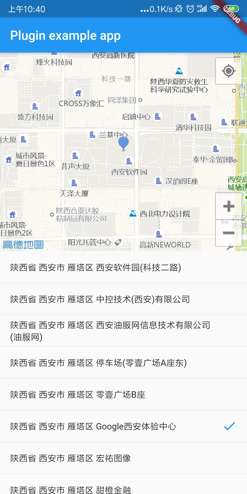

# flutter_2d_amap

本插件主要服务于 [flutter_deer](https://github.com/simplezhli/flutter_deer)。仅保持现有功能，需要的功能可自行拓展。

高德2D地图插件（已支持[1.12版本新的android插件api]("https://flutter.dev/docs/development/packages-and-plugins/plugin-api-migration")）

## 效果展示



## 实现功能包括

* 支持Android、iOS、Web（[玩玩Flutter Web —— 实现高德地图插件](https://weilu.blog.csdn.net/article/details/106465792)）
* 处理地图所需权限申请
* 定位并自动移动地图至当前位置
* 默认获取POI数据并返回
* 支持传入经纬度来移动地图
* 支持搜索POI

## 使用方式

```dart

flutter_2d_amap:
    git:
      url: https://github.com/simplezhli/flutter_2d_amap.git

import 'package:flutter_2d_amap/flutter_2d_amap.dart';


AMap2DView(
  onPoiSearched: (result) {

  },
  onAMap2DViewCreated: (controller) {

  },
)

```

### Android

AndroidManifest.xml 中添加：

```java

<meta-data
     android:name="com.amap.api.v2.apikey"
     android:value="配置你的key"/>

```

如果你的`targetSdkVersion`为27以上，则需要做以下配置来支持http明文请求（具体可以看demo），否则会导致地图加载不出：

AndroidManifest.xml 中添加：

```java
<application
  android:networkSecurityConfig="@xml/network_security_config"
/>

```

在 res 下新增一个 xml 目录，然后创建一个名为：`network_security_config.xml` 文件：

```xml
<?xml version="1.0" encoding="utf-8"?>
<network-security-config>
    <base-config cleartextTrafficPermitted="true" />
</network-security-config>
```

### iOS

使用前设置key：

```dart

Flutter2dAMap.setApiKey("配置你的key");

```

在info.plist中增加:

```xml
<key>NSLocationAlwaysAndWhenInUseUsageDescription</key>
<string>地图功能需要您的定位服务，否则无法使用，如果您需要使用后台定位功能请选择“始终允许”。</string>

<key>NSLocationAlwaysUsageDescription</key>
<string>地图功能需要您的定位服务，否则无法使用。</string>

<key>NSLocationWhenInUseUsageDescription</key>
<string>地图功能需要您的定位服务，否则无法使用。</string>

<key>io.flutter.embedded_views_preview</key>
<true/>

```

### Web

`index.html`中添加（在`main.dart.js`之前）：

```html
<script src="https://webapi.amap.com/loader.js"></script>
```

使用`AMap2DView`时添加 `webKey`：

```dart

AMap2DView(
  webKey: 'xxx',
)

```

## License

	Copyright 2019 simplezhli

    Licensed under the Apache License, Version 2.0 (the "License");
    you may not use this file except in compliance with the License.
    You may obtain a copy of the License at

       http://www.apache.org/licenses/LICENSE-2.0

    Unless required by applicable law or agreed to in writing, software
    distributed under the License is distributed on an "AS IS" BASIS,
    WITHOUT WARRANTIES OR CONDITIONS OF ANY KIND, either express or implied.
    See the License for the specific language governing permissions and
    limitations under the License.
